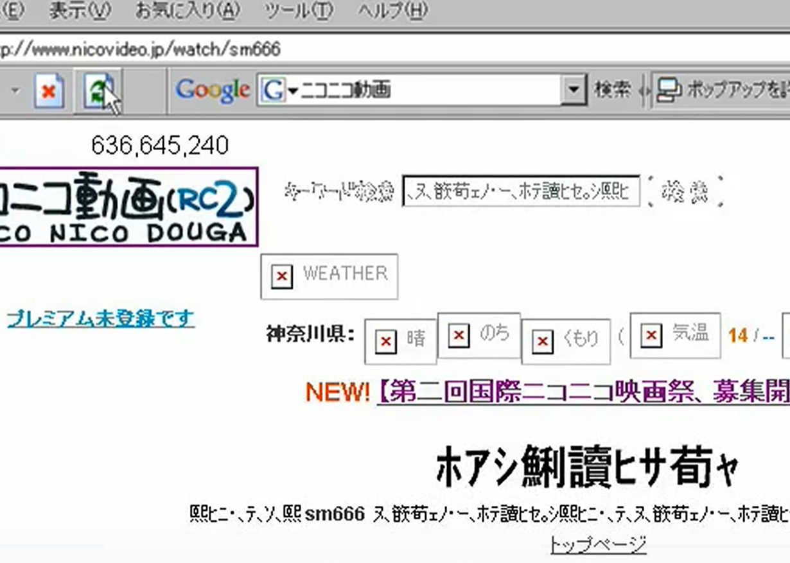
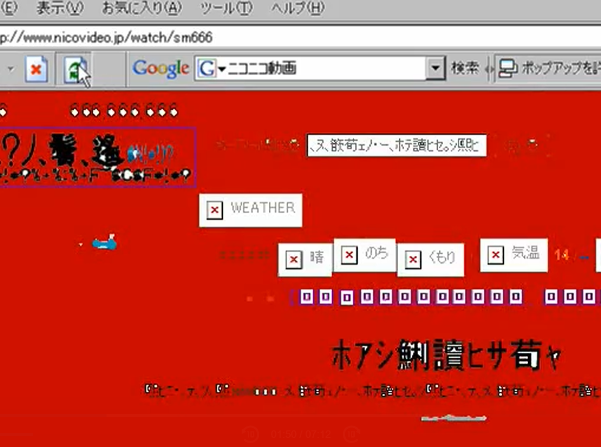
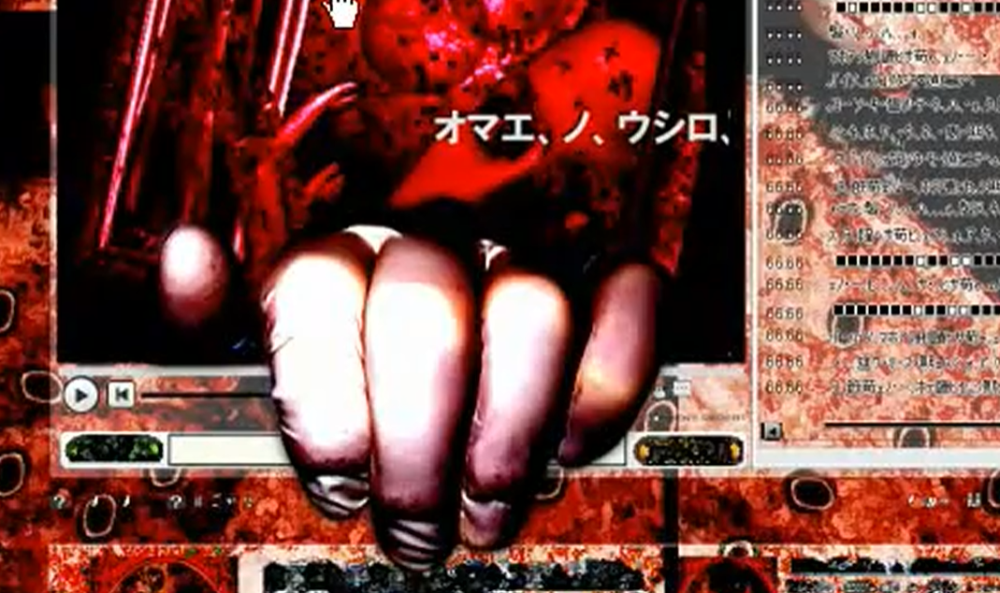
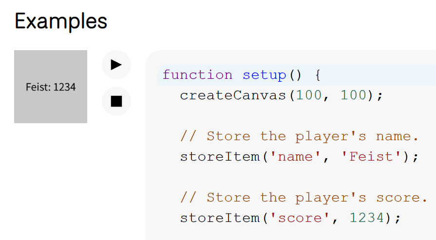
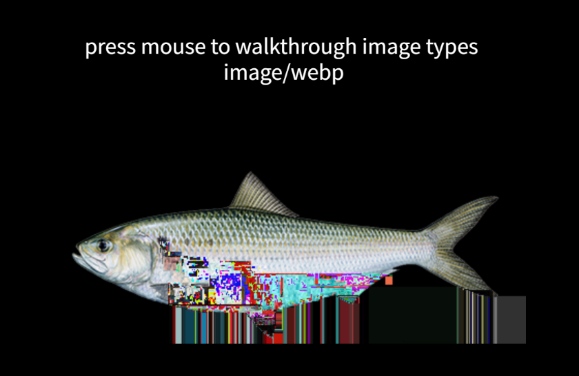
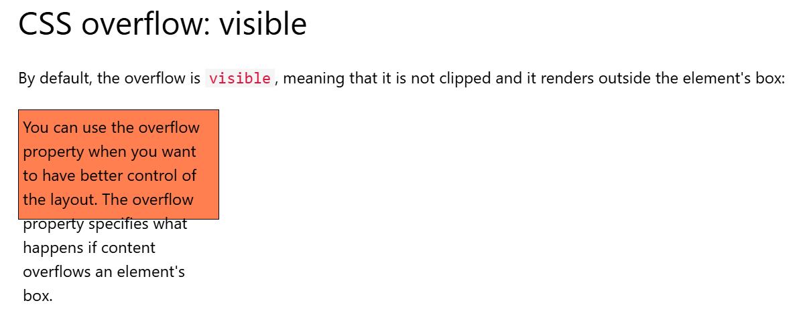

  # *Quiz 8*

##  Part 1: Imaging Technique Inspiration
Unfortunately, it occurred to me a video called "sm666", which scared me a lot when I was still a primary school student.   

It shows a website which gets more and more horrible if you keep on refreshing it. That's the first inspiration —— change when refreshing.   

I also think this video is a kind of glitch art. Texts get corrupted during refreshing. Besides, there will be a hand grabbing the progress bar in the end. 

These are unconventional ideas that create striking visual effects.  

> These are screenshots of that horrible vedio (I tried to find other websites with same functions so that I won't scare dear Carlos, but I failed :(  Sorry Carlos )

> The original website

>First change

> Second change (sorry

> Hand in the end (sorryyyyyyyy

## Part 2: Coding Technique Exploration
For refreshing idea, I found localStorage in p5.js can help, because I can store a refreshing counter with it.   

> localStorage
  

https://p5js.org/reference/p5/storeItem/

For glitch art, I found a really nice guy who wrote p5.js library for glitching images and binary files in the web browser. Thank you ted davis. 
Also GLSL Shaders performs better than p5.js. 

> Glitch art
  

https://ffd8.github.io/p5.glitch//#glitch-functions  
https://editor.p5js.org/parks315/sketches/w0fbRGQFo

For a hand grabbing progress bar, it's a little bit hard only doing with p5.js. CSS Overflow can help show something out of canvas edge. 

> CSS Overflow

https://www.w3schools.com/css/css_overflow.asp